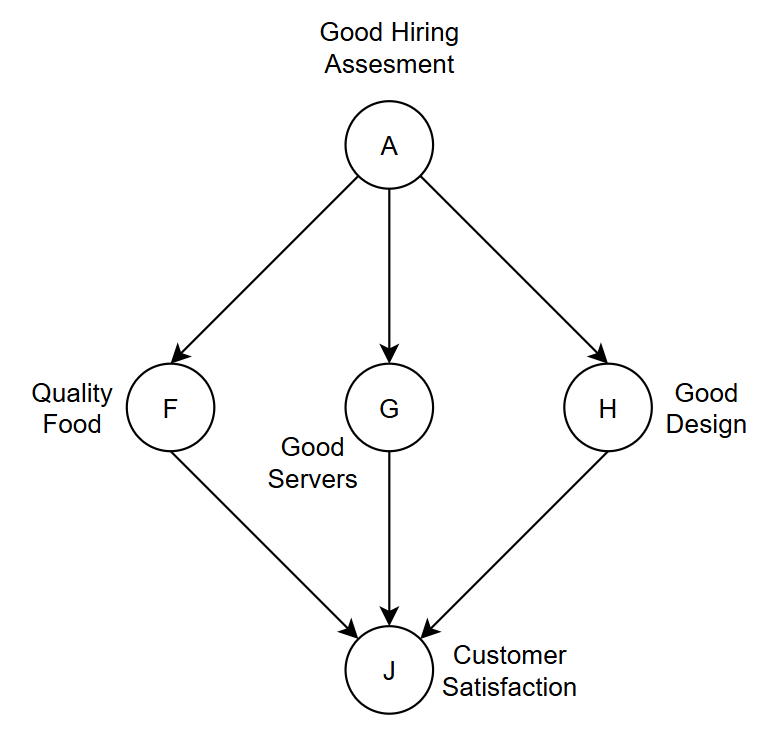

# Lab: Probabilistic Graphical Models & Naive Bayes
## Activity 1: Linear Chain
### Task 1: Coding (Colab)

We are given:
| A = 0 | A = 1 |
| ----- | ----- |
| 0.9   | 0.1   |

| A     | B = 0 | B = 1 |
| ----- | ----- | ----- |
| A = 0 | 0.8   | 0.2   |
| A = 1 | 0.1   | 0.9   |

| B     | C = 0 | C = 1 |
| ----- | ----- | ----- |
| B = 0 | 0.95  | 0.05  |
| B = 1 | 0.30  | 0.70  |

Since $P(A|C) = \dfrac{P(C|A)P(A)}{P(C)}$ 

To find $P(C)$, we need to find $P(B)$ first:
From the Law of Total Probability: \
$P(B) = P(B|A)P(A) + P(B|\neg A)P(\neg A)$ \
$P(B) = 0.9\times 0.1 + 0.2\times 0.9$ \
$P(B) = 0.27$

| B = 0 | B = 1 |
| ----- | ----- |
| 0.73   | 0.27   |

$P(C) = P(C|B)P(B) + P(C|\neg B)P(\neg B)$ \
$P(C) = 0.7\times 0.27 + 0.05\times 0.73$ \
$P(C) = 0.2255$

| C = 0 | C = 1 |
| ----- | ----- |
| 0.7745   | 0.2255   |

From the Chapman-Kolmogorov equation: \
$P(C|A) = P(C|B)P(B|A) + P(C|\neg B)P(\neg B|A)$ \
$P(C|A) = 0.7\times 0.9 + 0.05\times 0.1$ \
$P(C|A) = 0.635$

$P(A|C) = \dfrac{0.635\times 0.1}{0.2255}$ \
$P(A/C) \approx 0.2816$

## Activity 2: V-Structure and Diamond Network
### Task 2: Coding (V-Structure)

We are given:
| S = 0 | S = 1 |
| ----- | ----- |
| 0.8   | 0.2   |

| F = 0 | F = 1 |
| ----- | ----- |
| 0.9   | 0.1   |

| S     | F     | O = 0 | O = 1 |
| ----- | ----- | ----- | ----- |
| S = 0 | F = 0 | 0.99  | 0.01  |
| S = 0 | F = 1 | 0.30  | 0.70  |
| S = 1 | F = 0 | 0.20  | 0.80  |
| S = 1 | F = 1 | 0.05  | 0.95  |

We are finding $P(S|O) = \dfrac{P(O|S)P(S)}{P(O)}$

$P(O) = P(O|\neg S,\neg F)P(\neg S)P(\neg F) + P(O|\neg S, F)P(\neg S)P(F) + P(O|S,\neg F)P(S)P(\neg F) + P(O|S,F)P(S)P(F)$ \
$P(O) = (0.01\times 0.8\times 0.9) + (0.70\times 0.8\times 0.1) +(0.80\times 0.2\times 0.9) + (0.95\times 0.2\times 0.1)$ \
$P(O) = 0.2262$

$P(O|S) = P(O|S,\neg F)P(\neg F) + P(O|S,F)P(F)$ \ 
$P(O|S) = (0.80\times 0.9) + (0.95\times 0.1)$ \
$P(O|S) = 0.815$ 

$P(S|O) = \dfrac{0.815\times 0.2}{0.2262}$ \
$P(S|O) \approx 0.7206$

### Task 3: Coding (Diamond Network)

Let's assume some probabilities!

So, let's say an AI model has a fair chance of being a quality one. We will assume, that around 55% of AI models are quality models.

| A = 0 | A = 1 |
| ----- | ----- |
| 0.45  | 0.55  |

Next, if an AI model is a quality one, then the chances for it to give an inaccurate prediction must be pretty low, let's say 10%

However, if it's not, then there's a fairly high chance it'll be inaccurate, let's say 60%

| A     | B = 0 | B = 1 |
| ----- | ----- | ----- |
| A = 0 | 0.60  | 0.40  |
| A = 1 | 0.10  | 0.90  |

Then, the latency, this is a tricky one, a quality AI model doesn't necessarily has to have a low latency, however latency does contribute towards quality, and therefore it's a nice-to-have feature. Let's say a quality AI model has a 35% chance of having low latency.

If an AI is not a quality one, then the chances of having low latency must be lower, let's say 15%.

| A     | D = 0 | D = 1 |
| ----- | ----- | ----- |
| A = 0 | 0.85  | 0.15  |
| A = 1 | 0.65  | 0.35  |

Now, let's move on to customer's satisfaction.

A customer would be at least likely to be unsatisfied by an AI model with accurate prediction and low latency, let's say around 2% does feel unsatisfied for some reason.

If the latency is not low, yet it's still accurate, the overall customer satisfaction wouldn't change much, let's say around 10% of the customers are unsatisfied because some of are impatient.

If a model is inaccurate even with low latency, the overall satisfaction would be real low, let's say around 15% of people is satisfied because it can gave out basic answers. 

If an AI model is neither accurate or has low latency, most people wouldn't be satisfied for sure, let's say around 5% of people is satisfied due to the future potential of the model.

| B     | D     | C = 0 | C = 1 |
| ----- | ----- | ----- | ----- |
| B = 0 | D = 0 | 0.95  | 0.05  |
| B = 0 | D = 1 | 0.85  | 0.15  |
| B = 1 | D = 0 | 0.10  | 0.90  |
| B = 1 | D = 1 | 0.02  | 0.98  |

Now let's find out "How likely for an AI to be a quality model if a customer is satisfied with it?" $P(A|C)$

$P(A|C) = \dfrac{P(C|A)P(A)}{P(C)}$

By applying probability 

$P(C|A) = P(C|\neg B, \neg D)P(\neg B|A)P(\neg D|A) + P(C|\neg B,D)P(\neg B|A)P(D|A) + P(C|B,\neg D)P(B|A)P(\neg D|A) + P(C|B,D)P(B|A)P(D|A)$
$P(C|A) = (0.05\times 0.10\times 0.65) + (0.15\times 0.10\times 0.35) + (0.90\times 0.90\times 0.65) + (0.98\times 0.90\times 0.35)$
$P(C∣A) \approx 0.844$
This means that **if the AI model is a quality model, the probability of customer satisfaction is approximately 84%**.

## Activity 3: Complex Network Design
### Task 4: System Design & Calculation

Let's design our own Bayesian Network.

In this case, we are modeling **customer satisfaction in a restaurant**.

- **A** : Good Hiring Assessment  
- **F** : Quality Food  
- **G** : Good Servers  
- **H** : Good Design  
- **J** : Customer Satisfaction  

The idea is that if the restaurant performs a **good hiring assessment**, it is more likely to hire better employees and managers.  
This can influence the **food quality**, **service quality**, and **restaurant design**, which together affect **customer satisfaction**.

---

### Prior Probability of A

Let's assume that a restaurant has around a **60% chance of performing a good hiring assessment**.

| A = 0 | A = 1 |
|-----|-----|
| 0.40 | 0.60 |

---

### Food Quality (F)

If the hiring process is good, the restaurant is more likely to hire **better chefs**, resulting in higher food quality.

If the hiring process is poor, the food quality is less likely to be good.

| A | F = 0 | F = 1 |
|-----|-----|-----|
| A = 0 | 0.65 | 0.35 |
| A = 1 | 0.25 | 0.75 |

---

### Good Servers (G)

Good hiring assessment should also increase the chances of hiring **good servers**.

| A | G = 0 | G = 1 |
|-----|-----|-----|
| A = 0 | 0.70 | 0.30 |
| A = 1 | 0.20 | 0.80 |

---

### Good Design (H)

A good hiring process might also bring in **competent managers**, who are more likely to create a well-designed restaurant environment.

| A | H = 0 | H = 1 |
|-----|-----|-----|
| A = 0 | 0.60 | 0.40 |
| A = 1 | 0.30 | 0.70 |

---

### Customer Satisfaction (J)

Customer satisfaction depends on the **food quality, service quality, and restaurant design**.

Naturally, customers are most satisfied when **all three are good**.

| F | G | H | J = 0 | J = 1 |
|-----|-----|-----|-----|-----|
| F = 0 | G = 0 | H = 0 | 0.95 | 0.05 |
| F = 0 | G = 0 | H = 1 | 0.85 | 0.15 |
| F = 0 | G = 1 | H = 0 | 0.80 | 0.20 |
| F = 0 | G = 1 | H = 1 | 0.60 | 0.40 |
| F = 1 | G = 0 | H = 0 | 0.70 | 0.30 |
| F = 1 | G = 0 | H = 1 | 0.40 | 0.60 |
| F = 1 | G = 1 | H = 0 | 0.25 | 0.75 |
| F = 1 | G = 1 | H = 1 | 0.05 | 0.95 |

---

### Finding $P(J|A)$

Now let's find out **how likely customers are to be satisfied if the restaurant performs a good hiring assessment**.

$P(J|A) = \sum_{F,G,H} P(J|F,G,H)P(F|A)P(G|A)P(H|A)$

Expanding all combinations:

$P(J|A) = P(J|\neg F,\neg G,\neg H)P(\neg F|A)P(\neg G|A)P(\neg H|A)$ \
$+ P(J|\neg F,\neg G,H)P(\neg F|A)P(\neg G|A)P(H|A)$ \
$+ P(J|\neg F,G,\neg H)P(\neg F|A)P(G|A)P(\neg H|A)$ \
$+ P(J|\neg F,G,H)P(\neg F|A)P(G|A)P(H|A)$ \
$+ P(J|F,\neg G,\neg H)P(F|A)P(\neg G|A)P(\neg H|A)$ \
$+ P(J|F,\neg G,H)P(F|A)P(\neg G|A)P(H|A)$ \
$+ P(J|F,G,\neg H)P(F|A)P(G|A)P(\neg H|A)$ \
$+ P(J|F,G,H)P(F|A)P(G|A)P(H|A)$

Substituting the values:

$P(J|A) = (0.05\times0.25\times0.20\times0.30)$ \
$+ (0.15\times0.25\times0.20\times0.70)$ \
$+ (0.20\times0.25\times0.80\times0.30)$ \
$+ (0.40\times0.25\times0.80\times0.70)$ \
$+ (0.30\times0.75\times0.20\times0.30)$ \
$+ (0.60\times0.75\times0.20\times0.70)$ \
$+ (0.75\times0.75\times0.80\times0.30)$ \
$+ (0.95\times0.75\times0.80\times0.70)$

$P(J|A) \approx 0.6845$

---

### Final Result

$P(J=1|A=1) \approx 0.68$

This means that **if the restaurant performs a good hiring assessment, the probability of customer satisfaction is approximately 68%**.
